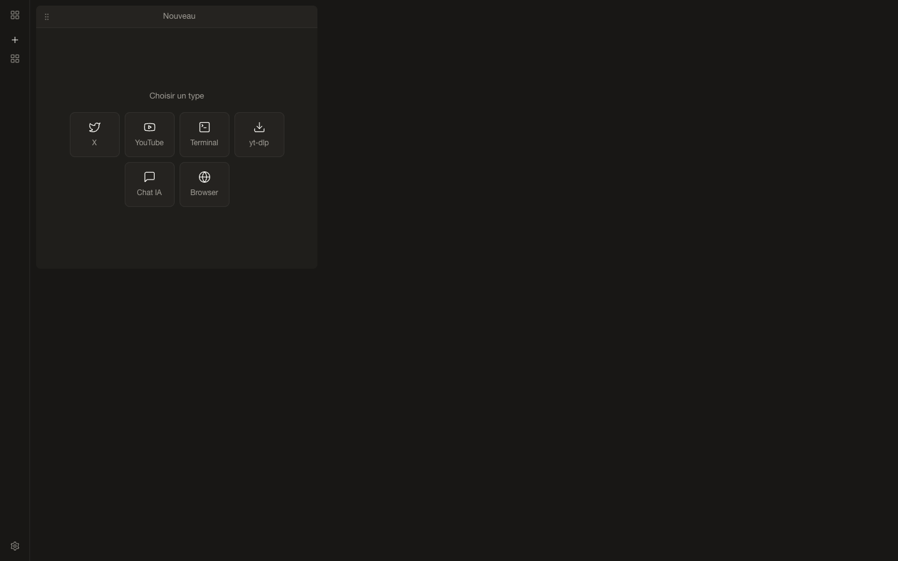

# Personal OS

Prototype de cockpit desktop : navigateur, YouTube, terminal, chat OpenRouter, extraction yt-dlp et fil X. Tauri2/Rust, React19/TypeScript, grille redimensionnable, Zustand, SQLite et webviews natives. Pas une application déclarée prête pour la production.



Capture Chromium réelle, pas une application macOS reconstruite. Le frontend compile ; le linker Rust réclame la licence Xcode. Aucun terminal natif, téléchargement, appel OpenRouter ou parcours SQLite validé ici.

## Lancer

Node22+ et npm :

```sh
npm ci --ignore-scripts
npm run build
npm run preview -- --host 127.0.0.1 --port 4186
```

Ouvrir http://127.0.0.1:4186. Ce build produit TypeScript/Vite, pas de binaire Rust. Le mode web permet d’examiner l’interface, pas de remplacer le runtime natif.

Pour l’application native : Rust>=1.77.2, outils/SDK de plateforme et licence Xcode examinée et acceptée par l’utilisateur sur macOS :

```sh
npm run tauri dev
# Pour empaqueter :
npm run tauri build
```

X/yt-dlp supposent leurs outils externes ; le chat demande une clé OpenRouter personnelle. Le terminal exécute des commandes système. Ne pas publier clés, conversations ou historique. Sources via GitHub Code → Download ZIP ; aucun installateur natif actuel fourni.

## État et reprise

- Six types de panneau et commandes Rust présents, sans validation de chaque parcours. Création d’un panneau vide et sélecteur exercés dans Chromium.
- L'outillage lint charge après ajout de `typescript-eslint`8.59.1 et déclaration directe de `@eslint/js`9.39.4. `npm run lint` signale encore quatre erreurs et douze avertissements dans le code préexistant ; le lint ne passe pas. Aucun correctif applicatif dans cette préparation.
- Audit installation : huit alertes (six élevées, une modérée, une faible), à revoir avant distribution.
- Build : chunk JavaScript746kB, avertissement de taille ; aucune mesure de mémoire ou démarrage revendiquée.
- Après déblocage Apple : vérifier SQLite, webviews, PTY, téléchargements synthétiques et persistance, puis refaire captures natives.

Snapshot de l’état local incluant les ajouts non committés, source originale à `9da1f75e31edc57f53daecbac4d8a8b1cb432010`, intacte. Historique d’anciens scripts/configurations non réévalués, notes d’agents, lanceur à chemin local, caches et données personnelles exclus.

Voir [VERIFICATION.md](VERIFICATION.md).
